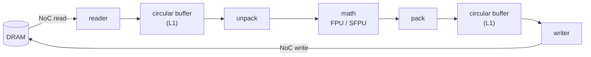

# TensixFuse

How much DRAM traffic does kernel fusion actually save on a Tenstorrent chip? And how far can a model's weights be pushed into Tenstorrent's block-float formats before the model notices? I'm writing fused kernels for Tensix cores to find out, in TT-Lang (Tenstorrent's Python kernel language) and by hand in TT-Metalium C++, and running two real models through them: GPT-2's MLP blocks and the classifier head of [GPU-CorruptNet](https://github.com/tanaymihani/gpu-corruptnet), my GPU-corruption detector.

**Status: in progress, started October 2026.** The kernels aren't written yet. What's here so far is the design and an analytic model of how much data each version of the kernel moves. Once the kernels run, the simulator's measurements replace the model, and a test checks that the two match tile for tile.

Everything device-side runs on Tenstorrent's simulators, not silicon: TT-Lang's functional simulator, which logs every tile that moves between DRAM, L1 and other cores, and [ttsim](https://github.com/tenstorrent/ttsim), a full-system simulator of Wormhole and Blackhole chips that is designed to be bit-exact with the hardware. That's enough for correctness and data movement. It isn't enough for timing, because ttsim doesn't model it, so this project won't report device latency.

## Status

| Milestone | Scope | State |
|---|---|---|
| M0 | TT-Lang simulator on macOS, ttsim on Linux x86_64 (Wormhole, Blackhole), pinned versions | in progress |
| M1 | Analytic DRAM traffic model for fused and unfused kernels | done (below) |
| M2 | Fused matmul + bias + activation in TT-Lang, unfused baseline, block sweep, NoC multicast | next |
| M3 | bfloat8_b and bfloat4_b weights and math fidelity on GPT-2's 12 MLP blocks | planned |
| M4 | TT-Metalium C++: fused BatchNorm + ReLU (host code plus reader, compute and writer kernels) | planned |
| M5 | GPU-CorruptNet's classifier head on simulated Blackhole | planned |
| M6 | Tests, CI on simulated Wormhole and Blackhole, container image | planned |
| M7 | Sharded benchmark sweep: Helm chart (JobSet) tested on kind, Ansible node setup with health checks, releases | planned |
| M8 | Tensor-parallel GPT-2 MLP across 2 and 4 simulated chips | planned |

## How a tile moves

Every op on a Tensix core is the same loop. Each core has five small RISC-V processors: two move data (reader and writer) and three drive the compute engine (unpack, math, pack). They hand 32×32 tiles to each other through circular buffers in the core's 1.4 MiB of SRAM (L1), and the cores talk to DRAM and to each other over two NoCs.

Unfused, each op is one trip around this loop, and each op's output goes back to DRAM before the next op reads it in again. Fused, the bias add and the activation happen in the math stage before pack, so those intermediates never leave the core.

## What fusion should save

`y = relu(a @ b + c)` at M = K = N = 1024 in bf16, where a 32×32 tile is 2 KiB. The matmul is blocked the way TT-Lang's matmul tutorial does it: each block of output tiles streams its row panel of A and column panel of B from DRAM, so smaller blocks re-read the inputs more often. "Unfused" is the same matmul followed by separate add and ReLU operations, each writing its output to DRAM.

These numbers come from the analytic model (M1), not from the simulator yet.

| Matmul data reuse | Cores | Unfused | Fused | Fusion saves |
|---|---|---|---|---|
| 1×1 tile blocks | 1 | 140 MiB | 132 MiB | 6% |
| 4×4 tile blocks | 1 | 44 MiB | 36 MiB | 18% |
| 8×8 tile blocks | 1 | 28 MiB | 20 MiB | 29% |
| 4×4 blocks per core, 8×8 grid | 64 | 44 MiB | 36 MiB | 18% |
| same, with A and B multicast | 64 | 16 MiB | 8 MiB | 50% |

Three things fall out of this before writing any kernel code:

- **Fusion always saves the same 8 MiB here:** two intermediate tensors, each written to DRAM and read back. With 1×1 blocks that's 6% of the traffic and fusion barely shows. Once the matmul reads each input only once, it's half.
- **More cores don't cut DRAM traffic by themselves.** 64 cores with 4×4 blocks each still fetch their own A and B panels, so together they move exactly as much as one core with 4×4 blocks. Multicast is what changes it: one core per row reads its A panel and sends it along the row over the NoC, one core per column does the same for B, and every input tile leaves DRAM once. That's the 8 MiB floor.
- **L1 caps the block size.** With every buffer double-buffered, an 8×8 block needs 1 MiB of buffers and a 16×16 block needs 3.5 MiB, while TT-Lang budgets 1,432 KiB per core.

M2 checks all of this against the simulator's tile counts from `tt-lang-sim-stats`.

## Block-float formats

bfloat8_b and bfloat4_b store one 8-bit exponent for every 16 values, and each value keeps a sign and 7 or 3 bits of mantissa measured against the largest value in its group. For GPT-2 small's 12 MLP blocks (`c_fc` from 768 to 3072, then `c_proj` from 3072 to 768), the weights take:

| Weights | Bytes per 32×32 tile | MLP weights, 12 blocks | vs bf16 |
|---|---|---|---|
| bf16 | 2,048 | 108.0 MiB | |
| bfloat8_b | 1,088 | 57.4 MiB | 47% smaller |
| bfloat4_b | 576 | 30.4 MiB | 72% smaller |
| bfloat4_b `c_fc`, bfloat8_b `c_proj` | | 43.9 MiB | 59% smaller |

M3 measures what that costs. The shared exponent is the risk: in bfloat4_b, any value 16x or more smaller than the largest in its group is stored as zero, so a few large weights can flatten their neighbors. I'll measure PCC for every block on ttsim, which matches the hardware's arithmetic bit for bit, along with the math fidelity setting (LoFi to HiFi4) that trades multiplier passes for precision.

## What the rest will test

- **GPU-CorruptNet's head (M5).** One linear layer from 2,048 pooled features to 10 logits, read through a sigmoid with a `>= 0.5` threshold. It runs as a single fused `sigmoid(x @ W + b)` kernel on cached features for 4,160 test frames, which is exactly 130 tile rows. The 10 outputs get padded to a 32-wide tile, and the padded columns come out as sigmoid(0) = 0.5, which passes the threshold, so they have to be sliced off before thresholding. I'll compare label sets and macro-F1 with PyTorch (0.911 on seen content, 0.876 on unseen).
- **BatchNorm + ReLU in C++ (M4).** At inference time BatchNorm is a per-channel scale and shift, so the step after each conv in ResNet-50 is `relu(x * s + b)`. I'm writing it as a TT-Metalium program with `s` and `b` from a real layer of GPU-CorruptNet's fine-tuned ResNet-50, checked against NumPy on simulated Wormhole and Blackhole.
- **Infrastructure (M6, M7).** CI that runs the tests on simulated Wormhole and Blackhole chips in a pinned container and fails a PR if any kernel's PCC drops or its DRAM tile count goes up. The benchmark sweep sharded across hosts and packaged as a Kubernetes JobSet. An Ansible playbook that turns a bare Ubuntu host into a simulator node and checks it with known-answer kernels.
- **Across chips (M8).** GPT-2's MLP split the Megatron way (`c_fc` by columns with GELU applied locally, `c_proj` by rows) needs one 192 KiB all-reduce per block for 128 tokens in bf16. Splitting both layers along K needs 960 KiB. TT-Lang's multi-device simulator will show whether the transfers match.

## Ground rules

- Device numbers come only from the simulators, and every result says which one.
- No device latency or throughput.
- Every number will be regenerated by one command, with the analytic number next to the measured one wherever both exist.
