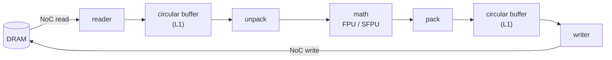

# TensixFuse

[](https://github.com/tanaymihani/tensixfuse/actions/workflows/ci.yml)
[](https://github.com/tanaymihani/tensixfuse/actions/workflows/ttsim.yml)
[](https://github.com/tanaymihani/tensixfuse/actions/workflows/metalium.yml)

How much DRAM traffic does kernel fusion actually save on a Tenstorrent chip? And how far can a model's weights be pushed into Tenstorrent's block-float formats before the model notices? I wrote fused kernels for Tensix cores to find out, in TT-Lang (Tenstorrent's Python kernel language) and by hand in TT-Metalium C++, and ran two real models through them: GPT-2's MLP blocks and the classifier head of [GPU-CorruptNet](https://github.com/tanaymihani/gpu-corruptnet), my GPU-corruption detector.

None of this ran on silicon. Device numbers come from Tenstorrent's two simulators: TT-Lang's functional simulator, which logs every tile that moves between DRAM, L1 and other cores, and [ttsim](https://github.com/tenstorrent/ttsim), a full-system simulator of Wormhole and Blackhole chips that is designed to be bit-exact with the hardware. So correctness and data movement are real. Timing isn't, because ttsim doesn't model it, and I don't report any device latency.

The repo also runs like a small hardware lab with simulated chips: CI on simulated Wormhole and Blackhole, a C++ program built against Tenstorrent's released SDK, a pinned container, the benchmark sweep fanned out across hosts and as a Kubernetes JobSet, and an Ansible playbook that turns a bare Ubuntu machine into a checked simulator node.

## In brief

- **Fusion always saves the same 8 MiB. What changes is how much that's worth.** Fusing matmul, bias and ReLU at 1024³ removes two intermediate tensors, 8 MiB written to DRAM and read back. Next to a naive matmul that's 6% of all traffic. Once the matmul reads each input only once, it's half. The simulator agreed with my analytic model tile for tile on all 48 runs.
- **Data reuse mattered more than fusion.** Bigger blocks cut DRAM traffic from 132 to 20 MiB, and multicasting input panels over the NoC on a 64-core grid took it to 8 MiB, 16.5x below where I started.
- **Block-float weights on GPT-2.** bfloat8_b cuts the MLP weights 47% and the worst of the 12 blocks still has PCC 0.99982. bfloat4_b cuts 72% and the worst block falls to 0.961. If you keep one layer in bfloat8_b, it should be `c_fc`, not `c_proj`, which is the opposite of what I expected.
- **The format, not the chip's arithmetic, is where the error comes from.** A NumPy copy of tt-metal's block-float packer (bit-exact with it on a million values) predicts the simulated chip's PCC to the 5th decimal. The same reasoning says LoFi math fidelity should cost nothing with bfloat4_b weights, whose 3 mantissa bits fit in a single multiplier pass, and it measures that way.
- **My own model on a simulated Blackhole.** GPU-CorruptNet's head runs as one fused `sigmoid(x @ W + b)`. With bfloat8_b weights, 2 of 4,160 frames get a different label set from PyTorch, and macro-F1 is unchanged (0.9112 seen, 0.8756 unseen).
- **A TT-Metalium program by hand.** Fused BatchNorm + ReLU for a real ResNet-50 layer, 3.2 million values over 8 cores, with host code and reader, compute and writer kernels. The fp32 version lands every value within one bf16 step of NumPy, with identical results on simulated Wormhole and Blackhole.

## How a tile moves

Every op on a Tensix core is the same loop. Each core has five small RISC-V processors: two move data (reader and writer) and three drive the compute engine (unpack, math, pack). They hand 32×32 tiles to each other through circular buffers in the core's 1.4 MiB of SRAM (L1), and the cores talk to DRAM and to each other over two NoCs.



Unfused, each op is one trip around this loop, and each op's output goes back to DRAM before the next op reads it in again. Fused, the bias add and the activation happen in the math stage before pack, so those intermediates never leave the core.

## Results

Every table here is regenerated from the JSON in [`results/`](results) by `python bench/report.py`, which writes [`docs/RESULTS.md`](docs/RESULTS.md) with all sizes and every run. Each section says which simulator it came from. CI re-runs the studies on every change; across runs every table holds to the precision shown, except that GPT-2 PCCs can move in the 6th decimal (and once in the 5th), because the GPT-2 activations are captured with PyTorch on the runner's CPU, which isn't bit-reproducible across CPU types.

### 1. Fusion and data movement

`y = relu(a @ b + c)`, M = K = N = 1024, bf16, on TT-Lang's simulator (tt-lang-sim 1.1.6). "Unfused" is the same matmul followed by separate add and ReLU operations, written in TT-Lang with the same blocking, so fusion is the only difference. DRAM traffic is tiles read plus tiles written, from the simulator's trace, at 2 KiB per tile.

| Matmul data reuse | Cores | Unfused | Fused | Fusion saves |
|---|---|---|---|---|
| 1×1 tile blocks | 1 | 140 MiB | 132 MiB | 6% |
| 2×2 tile blocks | 1 | 76 MiB | 68 MiB | 11% |
| 4×4 tile blocks | 1 | 44 MiB | 36 MiB | 18% |
| 8×8 tile blocks | 1 | 28 MiB | 20 MiB | 29% |
| 4×4 blocks per core, 8×8 grid | 64 | 44 MiB | 36 MiB | 18% |
| same, with A and B multicast | 64 | 16 MiB | 8 MiB | 50% |

Before running anything I wrote an analytic model of how many tiles each kernel should move ([`traffic.py`](src/tensixfuse/traffic.py)). The simulator agrees with it tile for tile on all 48 runs: 4 sizes from 256 to 2048, 6 reuse levels, fused and unfused, and [`tests/test_sim_traffic.py`](tests/test_sim_traffic.py) keeps it that way. Every run that computed real values matched PyTorch with PCC 1.000000. That's expected, because the functional simulator does its math in fp32: it checks that the right tiles went to the right place, not the chip's arithmetic. The chip's arithmetic comes from ttsim, in everything below.

### 2. Block-float weights on GPT-2's MLPs

GPT-2 small has 12 MLP blocks: `c_fc` (768 to 3072), GELU, then `c_proj` (3072 to 768). I captured each block's real input on the first 128 tokens of the WikiText-2 test set and ran the blocks with TTNN on simulated Blackhole at HiFi4, weights in each format and activations in bf16. PCC is against the fp32 PyTorch block.

| Weights | MLP weights, 12 blocks | PCC, median block | PCC, worst block |
|---|---|---|---|
| bf16 | 108.0 MiB | 0.99999 | 0.99997 |
| bfloat8_b | 57.4 MiB | 0.99987 | 0.99982 |
| bfloat4_b | 30.4 MiB | 0.97698 | 0.96066 |
| bfloat4_b `c_fc`, bfloat8_b `c_proj` | 43.9 MiB | 0.98623 | 0.97500 |
| bfloat8_b `c_fc`, bfloat4_b `c_proj` | 43.9 MiB | 0.99050 | 0.98332 |

bfloat8_b and bfloat4_b store one 8-bit exponent for every 16 values, and each value keeps a sign and 7 or 3 bits of mantissa (hidden bit included) measured against the largest value in its group. A 32×32 tile is 1,024 values plus 64 shared exponents: 1,088 bytes for bfloat8_b and 576 for bfloat4_b, against 2,048 for bf16. In bfloat4_b, a value 16x or more smaller than the largest in its group is always stored as zero, and between 15 and 19% of the weights in every layer here end up as zero.

Math fidelity is the other knob: the matrix engine multiplies in 1 to 4 passes (LoFi, HiFi2, HiFi3, HiFi4), trading mantissa bits for speed. On block 6, the one bfloat4_b hurts most:

| Weights | LoFi | HiFi2 | HiFi3 | HiFi4 |
|---|---|---|---|---|
| bf16 | 0.99841 | 0.99993 | 0.99998 | 0.99998 |
| bfloat8_b | 0.99882 | 0.99979 | 0.99982 | 0.99982 |
| bfloat4_b | 0.96070 | 0.96070 | 0.96066 | 0.96066 |

With bfloat4_b weights, LoFi is as good as HiFi4: the weights only carry 3 mantissa bits, and the first pass already uses them all. With bf16 weights LoFi visibly costs, and HiFi3 already matches HiFi4. ttsim can't say how much faster LoFi would run, but one pass instead of four is the point of it.

### 3. GPU-CorruptNet's head on a simulated Blackhole

GPU-CorruptNet is a ResNet-50 that flags GPU rendering artifacts in frames, multi-label over 10 artifact types. Its head is one linear layer from 2,048 pooled features to 10 logits, read through a sigmoid with a `>= 0.5` threshold. I ran the backbone on CPU once for the 1,560 seen-content and 2,600 unseen-content test frames (recomputing the head from those features gives GPU-CorruptNet's published 0.911 and 0.876 macro-F1), and ran only the head on the simulator, fused, with the calibration temperature folded into the weights.

| Weights | Label sets match PyTorch | Frames that differ | Logit PCC | Macro-F1, seen | Macro-F1, unseen |
|---|---|---|---|---|---|
| PyTorch fp32 | | | | 0.9112 | 0.8756 |
| bf16 | 99.93% | 3 | 0.99996 | 0.9112 | 0.8754 |
| bfloat8_b | 99.95% | 2 | 0.99996 | 0.9112 | 0.8756 |
| bfloat4_b | 99.47% | 22 | 0.99984 | 0.9113 | 0.8768 |

The frames that flip are the ones whose logits sit right at zero, so bfloat4_b's slightly higher F1 is luck, not an improvement.

### 4. TT-Metalium C++: fused BatchNorm + ReLU

At inference time BatchNorm is a per-channel scale and shift, so the step after each conv in ResNet-50 is `y = relu(x * s + b)`. I wrote it as a TT-Metalium program in [`kernels/metalium/bn_relu`](kernels/metalium/bn_relu): host code that sets up the device, DRAM buffers, circular buffers and runtime arguments, and three kernels per core. The reader pulls activation tiles over the NoC (and each column's scale and shift once), compute does the math, and the writer sends finished tiles back. The input is the real input to GPU-CorruptNet's `layer4.2.bn3` for 32 frames, channels last: 1,568 × 2,048 values, 3,136 tiles over 8 cores. It's built in CI against tt-metal 0.79.0's released SDK packages and run on simulated Wormhole and Blackhole.

There are two compute kernels:

| Kernel | How | Bit-exact vs NumPy | Within 1 bf16 step | PCC |
|---|---|---|---|---|
| `fpu` | matrix engine, row broadcast, bf16 intermediate in L1 | 95.40% | 97.67% | 0.999986 |
| `sfpu` | vector engine, everything in fp32 registers, one rounding at the end | 99.78% | 100.00% | 1.000000 |

Both give identical results on Wormhole and Blackhole, and the same bits on every run. "NumPy" here is the same bf16 inputs in fp32, rounded to bf16 once.

### 5. Infrastructure

| Piece | What it does | Numbers |
|---|---|---|
| CI ([`ci.yml`](.github/workflows/ci.yml)) | Lint and 54 tests (model, block-float emulation, simulator-vs-model, regression gate) on Linux and macOS | on every push |
| ttsim matrix ([`ttsim.yml`](.github/workflows/ttsim.yml)) | 6 jobs, Wormhole and Blackhole × bf16, bfloat8_b and bfloat4_b, with a pinned simulator and PCC floors in [`bench/baselines.json`](bench/baselines.json) | 7 tests per chip, split by format |
| Regression gate | A PR fails if a PCC drops below its floor or a kernel's DRAM tile count goes above its baseline | |
| C++ build ([`metalium.yml`](.github/workflows/metalium.yml)) | Installs tt-metal's SDK packages, builds the program with CMake, runs both kernels on both chips | 3.2M values checked per run |
| Containers ([`docker/`](docker)) | Two pinned images, each tested before it's pushed to GHCR: `tensixfuse` with ttnn, SFPI and ttsim for both chips, and `tensixfuse-sweep` with TT-Lang's simulator | 2.1 GB and 1.1 GB; 7 ttsim tests per chip in under 20 s |
| Sharded sweep ([`sweep.yml`](.github/workflows/sweep.yml)) | The 48-run fusion sweep split over 8 GitHub-hosted runners with cost-balanced shards, merged and checked | 184 s on one runner, 76 s across 8 |
| Kubernetes ([`deploy/helm`](deploy/helm/tensixfuse-sweep)) | A Helm chart that runs the sweep as a [JobSet](https://github.com/kubernetes-sigs/jobset), one simulator pod per shard; CI runs it on a kind cluster | 4 pods finish in under 25 s on kind; all 24 runs match the model |
| Ansible ([`deploy/ansible`](deploy/ansible)) | `site.yml` turns a bare Ubuntu 24.04 host into a simulator node; `health_check` runs known-answer kernels on every simulated chip and fails the play on a mismatch. Tested with Molecule | under 100 s on a fresh VM; a second run changes nothing |

The simulator and the SFPI compiler are pinned to the versions tt-metal 0.79.0 itself pins, with checksums ([`ttsim-version`](ttsim-version), [`sfpi-version`](sfpi-version)). When the simulator changes, I want to know that the simulator changed, not wonder whether my kernel did.

## What I found

**Fusion's savings depend on everything else.** Fusing removes the same two intermediates at every row of the fusion table: 8 MiB at 1024³. With 1×1 blocks the matmul re-reads A and B so many times that 8 MiB is 6% of the traffic, and fusion barely shows. I expected fusion to be the headline. It turned out to matter most after the boring work of data reuse was done, when it's half of everything left.

**Spreading the work over 64 cores doesn't cut DRAM traffic by itself.** Each core still fetches its own A and B panels, so 64 cores with 4×4 blocks move exactly as much as one core with 4×4 blocks: 36 MiB. What helps is multicast. One core per row reads its A panel from DRAM and sends it over the NoC to the other seven in the row, one core per column does the same for B, and every input tile leaves DRAM once.

**L1 sets the block size.** With every buffer double-buffered, an 8×8 block takes 1 MiB of buffers and a 16×16 block takes 3,670,016 bytes, and the simulator warns that this is over its per-core limit of 1,466,368 bytes (1,432 KiB).

**I guessed the wrong layer.** Tenstorrent's `tt_transformers` performance mode puts the up and gate projections (FF1, FF3) in bfloat4_b with LoFi and keeps the down projection (FF2) in bfloat8_b. For GPT-2 that's bfloat4_b `c_fc` with bfloat8_b `c_proj`, so I expected that split to win. It's the worse one for GPT-2 small: at the same 43.9 MiB, keeping `c_fc` in bfloat8_b instead gives a worst block of 0.983 against 0.975. Llama's MLP is gated and uses SiLU, so this says nothing about Llama, only that the split is worth measuring per model.

**The error is in the format, not the arithmetic.** I wrote the block-float packer again in NumPy from tt-metal's source and checked it against ttnn on about a million values, outliers and rounding ties included: zero mismatches. Running the GPT-2 blocks on CPU with weights rounded that way gives the same PCC as the simulated chip to the 5th decimal in every configuration. So at HiFi4 the chip adds nothing measurable; the loss is the format itself. That's also why LoFi is free for bfloat4_b weights.

**Padding is easy to get wrong in a multi-label head.** 10 outputs don't fill a 32-wide tile, so the weights are padded to 32 columns. On the device, the padded columns come out as exactly sigmoid(0) = 0.5, and with a `>= 0.5` threshold that's a prediction: thresholding before slicing them off gives 22.92 labels per frame instead of 0.92.

**My first BatchNorm kernel rounded twice.** The FPU version stores `x * s` in L1 as bf16 before adding `b`, so it rounds twice, and the matrix engine reads operands at 16 or 19 bits. Against a reference that rounds the same way it matches 98%, not 95%, which pinned down where the rest came from. The SFPU version keeps everything in fp32 registers and lands every element within one bf16 step. On silicon the FPU version should be the faster one; ttsim can't say by how much.

**Getting the stack to run took more than the kernels did.** The `ttnn` wheel doesn't bundle SFPI, the RISC-V compiler tt-metal uses to build kernels at runtime, so that's pinned and installed separately. The SDK's `libtt_metal.so` needs Tenstorrent's OpenMPI build with ULFM fault tolerance, which the packages don't pull in, so linking failed on `MPIX_Comm_revoke` until I installed it. A slim Ubuntu image also needs `libatomic` and GCC's math libraries for SFPI's compiler. TT-Lang's simulator and the real `ttnn` can't share a Python environment either: with both installed, the simulator picks up the real `ttnn` and the kernels fail, which I found when the Kubernetes pods crashed. So the Dockerfile has two targets. And tt-lang-sim 1.1.6 replaces any kernel error with a `FileNotFoundError` for `ttl/ttl/diagnostics.py`, a file the wheel doesn't ship; [`kernels/ttlang/simfix.py`](kernels/ttlang/simfix.py) prints the real message. Its help text also says the per-core L1 limit is 1,336 KiB, while the code enforces 1,432.

**One run sets the floor for sharding.** Spread over 8 runners, the sweep is bounded by its largest single run, the unblocked 2048³ dry run, which takes about a minute on a hosted runner by itself. Balancing shards by predicted cost keeps the other big runs off that shard, but nothing gets the slowest shard below that one run.

## Limitations

- No silicon, so no device latency or throughput. DRAM traffic here counts tiles. It says nothing about bandwidth, NoC contention, or how much compute hides behind data movement.
- TT-Lang's functional simulator computes with PyTorch in fp32 and stores bfloat8_b as bf16, so it can check data movement but not numerics. Every accuracy number comes from ttsim.
- GPU-CorruptNet's head is small (20,490 parameters), and its backbone ran on CPU. GPT-2 small is a small model, and bigger LLMs have larger outliers, so bfloat4_b would likely do worse on them.
- The sweep's fan-out speedup is real but modest, because the sweep is short and one run dominates it.

## What I would do next

- Run the same kernels on a real Wormhole or Blackhole card and see how much of the DRAM saving turns into time, and what the SFPU BatchNorm costs next to the FPU one.
- Fuse the whole MLP (`c_fc`, GELU, `c_proj`) so the 128 × 3072 hidden activations stay in L1 across cores and never touch DRAM.
- Finish the tensor-parallel GPT-2 MLP on ttsim's 2-chip N300 build ([`bench/tp_mlp_n300.py`](bench/tp_mlp_n300.py)). Both simulated chips come up and the Ethernet fabric between them initializes, but host writes to the remote chip time out with tt-metal 0.79.0, which matches ttsim's note that multichip support isn't fully merged into mainline yet. My first attempt also stopped on ttsim's strict checks, with UndefinedBehavior in an unpacker reading and writing Float32, which I didn't get to the bottom of.

## Reproduce

**TT-Lang simulator (macOS or Linux):**

```bash
python3.11 -m venv .venv && source .venv/bin/activate   # Python 3.11 or newer
pip install -e ".[dev]"                                  # includes tt-lang-sim 1.1.6
pytest                                                   # 54 tests
python bench/fusion.py                                   # the fusion sweep, ~3 min
python bench/report.py                                   # docs/RESULTS.md
```

**ttsim (Linux x86_64), in the container or directly:**

```bash
docker run --rm -e TENSIXFUSE_ARCH=wormhole ghcr.io/tanaymihani/tensixfuse tensixfuse-doctor

pip install torch --index-url https://download.pytorch.org/whl/cpu
pip install ttnn==0.79.0 && pip install --no-deps -e .
bash scripts/install_sfpi.sh                  # pinned SFPI, checksum checked
eval "$(bash scripts/setup_ttsim.sh blackhole)"
pytest -m ttsim tests/test_ttsim.py
python model/gpt2_capture.py && python bench/quant_gpt2.py
bash scripts/fetch_data.sh && python bench/corruptnet_head.py
```

**The C++ program** needs tt-metal 0.79.0's SDK packages; [`metalium.yml`](.github/workflows/metalium.yml) has the exact install and build steps.

**The sweep on Kubernetes** (with the JobSet controller installed):

```bash
helm install sweep deploy/helm/tensixfuse-sweep --set shards=8
kubectl wait --for=condition=Completed jobset/sweep --timeout=30m
```

**A simulator node with Ansible:**

```bash
cd deploy/ansible && ansible-playbook site.yml   # then cat /var/lib/tensixfuse/health.json
```

## Layout

```
kernels/ttlang/        fused and unfused matmul, multicast variant, elementwise ops, runner
kernels/metalium/      bn_relu: host program, reader/writer kernels, FPU and SFPU compute kernels
src/tensixfuse/        traffic model, block-float emulation, metrics, simulator runner, doctor
model/                 GPU-CorruptNet export, GPT-2 MLP capture
bench/                 fusion sweep, GPT-2 and head studies, BatchNorm check, merge, report, baselines
tests/                 model, emulation, simulator-vs-model, regression gate, ttsim
docker/                pinned simulator image
deploy/helm/           JobSet sweep chart
deploy/ansible/        site.yml, roles/ttsim_node, roles/health_check, molecule/
.github/workflows/     ci, ttsim, metalium, docker, sweep, kubernetes, ansible, studies, scaleout
results/               every result the tables come from
docs/RESULTS.md        all the tables, generated
```

## License

MIT
