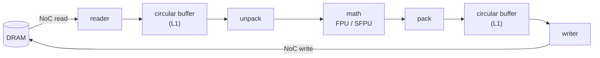

# TensixFuse

[](https://github.com/tanaymihani/tensixfuse/actions/workflows/ci.yml)
[](https://github.com/tanaymihani/tensixfuse/actions/workflows/ttsim.yml)
[](LICENSE)

How much DRAM traffic does kernel fusion actually save on a Tenstorrent chip? And how far can a model's weights be pushed into Tenstorrent's block-float formats before the model notices? I wrote fused kernels for Tensix cores to find out, in TT-Lang (Tenstorrent's Python kernel language) and by hand in TT-Metalium C++, and ran two real models through them: GPT-2's MLP blocks and the classifier head of [GPU-CorruptNet](https://github.com/tanaymihani/gpu-corruptnet), my GPU-corruption detector.

None of this ran on silicon. The device numbers come from Tenstorrent's two simulators: TT-Lang's functional simulator, which logs every tile that moves between DRAM, L1 and other cores, and [ttsim](https://github.com/tenstorrent/ttsim), a full-system simulator of Wormhole and Blackhole chips that is designed to be bit-exact with the hardware. So correctness and data movement are real. Timing isn't, because ttsim doesn't model it, and I don't report any device latency.

The repo also runs like a small hardware lab, just with simulated chips: CI on simulated Wormhole and Blackhole, a pinned container, a Helm chart that fans the benchmark sweep out across hosts, and an Ansible playbook that turns a bare Ubuntu machine into a checked simulator node.

## In brief

- **Fusion always saves the same 8 MiB. What changes is how much that's worth.** Fusing matmul, bias and ReLU at 1024³ removes two intermediate tensors, which is 8 MiB written to DRAM and read back. Next to a naive matmul that's 6% of all traffic. Once the matmul reads each input only once, it's half, and the fused kernel sits at the 8 MiB floor.
- **Data reuse mattered more than fusion.** Bigger blocks (1×1 to 8×8 tiles) cut DRAM traffic from 132 to 20 MiB. Multicasting the input panels over the NoC on a 64-core grid took it to 8 MiB, 16.5x below where I started. 16×16 blocks don't fit: they need 3.5 MiB of L1 and a core has 1,432 KiB to give.
- **Block-float weights.** On GPT-2's 12 MLP blocks, bfloat8_b cuts weight memory 47% with PCC 0.9997. bfloat4_b cuts 72%, but the worst block falls to PCC 0.962, because a few large weights set the shared exponent for their group of 16 and flatten their neighbors. Keeping `c_proj` in bfloat8_b gets the worst block back to 0.991 at 59% savings.
- **My own model on a simulated Blackhole.** GPU-CorruptNet's head runs as one fused `sigmoid(x @ W + b)` kernel. With bfloat8_b weights its predicted label sets match PyTorch on 99.8% of 4,160 test frames, and macro-F1 on unseen content goes from 0.876 to 0.875.
- **A TT-Metalium program by hand.** Fused BatchNorm + ReLU, the step after every conv in ResNet-50, written as host code plus reader, compute and writer kernels. It matches NumPy to within one bf16 step on every element, on simulated Wormhole and Blackhole.
- **Across chips.** Split Megatron-style over 2 and 4 simulated chips, a GPT-2 MLP block needs one 192 KiB all-reduce. Splitting along K instead moves 5x as much.

## How a tile moves

Every op on a Tensix core is the same loop. Each core has five small RISC-V processors: two move data (reader and writer) and three drive the compute engine (unpack, math, pack). They hand 32×32 tiles to each other through circular buffers in the core's 1.4 MiB of SRAM (L1), and the cores talk to DRAM and to each other over two NoCs.



Unfused, each op is one trip around this loop, and each op's output goes back to DRAM before the next op reads it in again. Fused, the bias add and the activation happen in the math stage before pack, so those intermediates never leave the core.

## Results

Everything below is regenerated by `python bench/run_all.py`, which rewrites [`docs/RESULTS.md`](docs/RESULTS.md). Each table says which simulator it came from.

### 1. Fusion and data movement

`y = relu(a @ b + c)`, M = K = N = 1024, bf16, on TT-Lang's simulator. "Unfused" is the same matmul followed by separate add and ReLU operations, written in TT-Lang with the same blocking, so fusion is the only difference. DRAM traffic is tiles read plus tiles written, from `tt-lang-sim-stats`, at 2 KiB per bf16 tile.

| Matmul data reuse | Cores | Unfused | Fused | Fusion saves |
|---|---|---|---|---|
| 1×1 tile blocks | 1 | 140 MiB | 132 MiB | 6% |
| 4×4 tile blocks | 1 | 44 MiB | 36 MiB | 18% |
| 8×8 tile blocks (largest that fits in L1) | 1 | 28 MiB | 20 MiB | 29% |
| 4×4 blocks per core, 8×8 grid | 64 | 44 MiB | 36 MiB | 18% |
| same, with A and B multicast | 64 | 16 MiB | 8 MiB | 50% |

Every number in this table matches my analytic model of the kernels tile for tile, and [`tests/test_traffic_model.py`](tests/test_traffic_model.py) checks that at 256, 512, 1024 and 2048. All variants match a PyTorch fp32 reference with PCC above 0.999 at those sizes, on the functional simulator and, for 256 and 512, through the full TT-Lang compiler on ttsim.

### 2. Block-float weights on GPT-2's MLPs

GPT-2 small has 12 MLP blocks: `c_fc` (768 to 3072), GELU, then `c_proj` (3072 to 768). I captured each block's real input on 128 tokens of WikiText-2 and ran the blocks with TTNN on simulated Blackhole at HiFi4, weights in each format and activations in bf16. PCC is against the fp32 PyTorch block.

| Weights | Bytes per tile | MLP weights, 12 blocks | PCC, median block | PCC, worst block |
|---|---|---|---|---|
| bf16 | 2,048 | 108.0 MiB | 0.99998 | 0.99996 |
| bfloat8_b | 1,088 | 57.4 MiB | 0.9997 | 0.9991 |
| bfloat4_b | 576 | 30.4 MiB | 0.987 | 0.962 |
| bfloat4_b `c_fc` + bfloat8_b `c_proj` | | 43.9 MiB | 0.996 | 0.991 |

bfloat8_b and bfloat4_b store one 8-bit exponent for every 16 values, and each value keeps a sign and 7 or 3 bits of mantissa measured against the largest value in its group. A 32×32 tile is 1,024 of those plus 64 shared exponents, which is where 1,088 and 576 bytes come from. The catch is the shared exponent: in bfloat4_b, any value 16x or more smaller than the largest in its group is stored as zero. More on that under What I found.

Math fidelity is the other Tenstorrent knob. The matrix engine can multiply in 1 to 4 passes (LoFi, HiFi2, HiFi3, HiFi4), trading mantissa bits for speed. On the block that bfloat4_b hurts most:

| Weights | LoFi | HiFi2 | HiFi3 | HiFi4 |
|---|---|---|---|---|
| bf16 | 0.9992 | 0.99991 | 0.99996 | 0.99996 |
| bfloat8_b | 0.9986 | 0.9991 | 0.9991 | 0.9991 |
| bfloat4_b | 0.962 | 0.962 | 0.962 | 0.962 |

With bfloat4_b weights, LoFi gives exactly the same output as HiFi4: the weights only carry 3 mantissa bits, and the first pass already uses all of them. With bfloat8_b, HiFi2 is enough. ttsim is bit-exact, so these are the numbers the chip would produce. It can't say how much faster LoFi is, but one pass instead of four is the point of it.

### 3. GPU-CorruptNet's head on a simulated Blackhole

GPU-CorruptNet is a ResNet-50 that flags GPU rendering artifacts in frames, multi-label over 10 artifact types. Its head is one linear layer from 2,048 pooled features to 10 logits, read through a sigmoid with a `>= 0.5` threshold. I computed the backbone features on CPU once, for the 1,560 seen-content and 2,600 unseen-content test frames, and ran only the head on the simulator. A few details mattered:

- 10 outputs don't fill a 32-wide tile, so the weights are padded to 2048 × 32. The padded columns come out as sigmoid(0) = 0.5, which passes a `>= 0.5` threshold, so they have to be cut off before thresholding, not after.
- The model's calibration temperature (T = 1.565) is folded into the weights and bias, so the calibrated head is still one fused op.
- 4,160 frames is exactly 130 tile rows, so the batch dimension needs no padding.

| Weights | Label sets match PyTorch | Logit PCC | Macro-F1, seen | Macro-F1, unseen |
|---|---|---|---|---|
| PyTorch fp32 (reference) | | | 0.911 | 0.876 |
| bf16 | 99.9% | 0.99998 | 0.911 | 0.876 |
| bfloat8_b | 99.8% | 0.9997 | 0.911 | 0.875 |
| bfloat4_b | 98.1% | 0.991 | 0.904 | 0.867 |

The frames that flip are the ones whose logits sit right at zero, where the PyTorch model was barely deciding either.

### 4. TT-Metalium C++: fused BatchNorm + ReLU

At inference time BatchNorm is a per-channel scale and shift, so the step after each conv in ResNet-50 is `y = relu(x * s + b)`. I wrote it as a TT-Metalium program in [`kernels/metalium/bn_relu`](kernels/metalium/bn_relu): host code that opens the device and sets up the DRAM buffers, circular buffers and runtime arguments, and three kernels that run on different RISC-V cores of each Tensix core.

- **reader** pulls activation tiles from DRAM into a circular buffer over the NoC, plus the `s` and `b` rows once
- **compute** multiplies and adds on the FPU with the per-channel rows broadcast down each tile, then applies ReLU on the SFPU
- **writer** sends finished tiles back to DRAM

`s` and `b` come from a real layer (`layer4.2.bn3`) of GPU-CorruptNet's fine-tuned ResNet-50, folded from its BatchNorm statistics. On that layer's input for 64 frames (3,136 rows × 2,048 channels), the result matches NumPy to within one bf16 step on every element, and it's bit-identical across runs on both simulated Wormhole and Blackhole.

### 5. Across chips: tensor-parallel MLP

TT-Lang's simulator can run one operation across several simulated devices, with collectives between them. I split GPT-2's MLP the Megatron way: `c_fc` by columns, so each chip computes its own slice of the 3,072 hidden units and applies GELU locally with no communication, then `c_proj` by rows, so each chip ends up with a partial 128 × 768 output and one all-reduce sums them.

| Split (128 tokens, bf16) | Data all-reduced per block |
|---|---|
| Megatron: `c_fc` by columns, `c_proj` by rows | 192 KiB |
| Both layers split along K | 960 KiB |

Splitting along K needs an all-reduce before GELU (768 KiB, since GELU isn't linear) and another after `c_proj` (192 KiB). The transfers in the simulator's stats match this on 2 and 4 devices. The partial sums are added in a fixed order, so the output is the same on every run.

### 6. Infrastructure

| Piece | What it does |
|---|---|
| CI | Every push runs lint and 152 tests on TT-Lang's simulator, on Linux and macOS (about 3 minutes). Pushes to `main` and PRs that touch kernels also run the ttsim suite in the container, as a matrix over Wormhole and Blackhole × bf16, bfloat8_b and bfloat4_b (6 jobs, about 14 minutes). |
| Regression gate | [`bench/baselines.json`](bench/baselines.json) holds a PCC floor and a DRAM tile count for every kernel. A PR fails if any PCC drops below its floor or any tile count goes up. |
| Container | `ghcr.io/tanaymihani/tensixfuse`, built on Tenstorrent's tt-metalium release image with the pinned ttsim binaries and SoC descriptors, tagged `<version>-ttsim<version>`. Pulling it takes CI about 2 minutes. Building tt-metal from source on the same runner took 52. |
| Sharded sweep | `bench/sweep.py --shard i/N` runs one slice of the 126-run sweep, and `bench/merge.py` rebuilds `docs/RESULTS.md`. On one runner the sweep takes 3 h 10 min. Sharded over 8 GitHub-hosted runners, 27 minutes. |
| Kubernetes | A Helm chart runs the sweep as a [JobSet](https://github.com/kubernetes-sigs/jobset), one simulator pod per shard. CI brings up a kind cluster and runs a 4-shard version end to end. |
| Ansible | `site.yml` turns a bare Ubuntu 22.04 host into a simulator node: packages, Docker, the pinned ttsim release with a checksum check, SoC descriptors and environment. The `health_check` role runs known-answer kernels on each simulated chip, writes a JSON report and fails the play on any mismatch. On a fresh 4-vCPU VM it takes 9 minutes, and a second run changes nothing. Tested with Molecule. |
| Releases | Pushing a `v*` tag builds the wheel and the image and publishes a GitHub Release with `RESULTS.md` and SHA-256 checksums. |

The ttsim version is pinned in [`ttsim-version`](ttsim-version) and only changes in its own commit, the same way tt-metal's weekly ttsim job does it. When the simulator changes, I want to know that the simulator changed, not wonder whether my kernel did.

## What I found

**Fusion's savings depend on everything else.** Fusing removes the same two intermediates at every row of the fusion table: 8 MiB at 1024³. With 1×1 blocks the matmul re-reads A and B so many times that 8 MiB is 6% of the traffic, and fusion barely shows. I expected fusion to be the headline. It turned out to matter most after the boring work of data reuse was done, when it's half of everything left.

**Spreading the work over 64 cores doesn't cut DRAM traffic by itself.** Each core still fetches its own A and B panels, so 64 cores with 4×4 blocks move exactly as much as one core with 4×4 blocks: 36 MiB. What helps is multicast. One core per row reads its A panel from DRAM and sends it over the NoC to the other seven in the row, one core per column does the same for B, and every input tile leaves DRAM once.

**L1 sets the block size.** With every buffer double-buffered, an 8×8 block takes 1 MiB and a 16×16 block takes 3.5 MiB, against 1,432 KiB available per core after the reserved space. The simulator rejects the 16×16 kernel when it sets up the buffers, before any math runs.

**Outliers are what break bfloat4_b.** In the GPT-2 blocks that lose the most, a handful of weights are much larger than the other 15 in their group of 16. They set the shared exponent, and with 3 mantissa bits most of their neighbors round to zero. The damage isn't spread evenly between the two layers: moving only `c_proj` back to bfloat8_b recovers most of the accuracy while keeping most of the savings. [`docs/DESIGN.md`](docs/DESIGN.md) has the per-group breakdown and why `c_proj` is the more sensitive one.

**ttsim is stricter than silicon, which is the point.** I deleted the `noc_async_read_barrier()` between the reader's DRAM read and its `cb_push_back` to see what would happen. On real hardware that bug usually goes unnoticed, because the read normally lands before compute gets to the tile. ttsim stopped on the first tile with `UnpredictableValueUsed`. That case is now a test.

**The GELU flavor didn't matter.** GPT-2 uses the tanh approximation of GELU and TT-Lang's simulator uses the exact one. The largest gap between them is 4.7e-4, which is less than one bf16 step at 1.0 (7.8e-3), so it doesn't show up in any table.

## Limitations

- No silicon, so no device latency or throughput. DRAM traffic here counts tiles. It says nothing about bandwidth, NoC contention, or how much compute hides behind data movement.
- TT-Lang's functional simulator computes with PyTorch, not the chip's arithmetic. That's why the quantization, fidelity and model results come from ttsim, which matches the hardware bit for bit by design.
- TT-Lang's simulator doesn't support bfloat4_b, so those runs go through TTNN.
- GPU-CorruptNet's head is small (20,490 parameters), and its backbone ran on CPU.
- GPT-2 small is a small model. Bigger LLMs have larger outliers, so bfloat4_b would likely do worse on them.
- ttsim's multichip support isn't finished in mainline tt-metal yet, so the tensor-parallel results come from TT-Lang's multi-device simulator only.

## What I would do next

- Run the same kernels on a real Wormhole or Blackhole card and see how much of the DRAM saving turns into time.
- Fuse the whole MLP (`c_fc`, GELU, `c_proj`) so the 128 × 3072 hidden activations stay in L1 across cores and never touch DRAM.
- A fused LayerNorm, and lowering GPU-CorruptNet's backbone through TT-Forge to see what the compiler does with it.

## Reproduce

**Mac or Linux, TT-Lang simulator only:**

```bash
python3.12 -m venv .venv && source .venv/bin/activate
pip install -e ".[dev]"                  # includes tt-lang-sim
pytest -m "not ttsim"
python bench/run_all.py --only fusion    # rewrites the fusion table in docs/RESULTS.md
```

**Linux x86_64, ttsim:**

```bash
docker run --rm -it ghcr.io/tanaymihani/tensixfuse:latest bash
tensixfuse doctor --arch blackhole       # known-answer check on a simulated chip
pytest -m ttsim --arch blackhole
python bench/run_all.py
```

Without Docker, `scripts/setup_ttsim.sh` installs the pinned `ttnn` wheel and ttsim release, copies the SoC descriptor next to the simulator, and prints the environment it needs:

```bash
export TT_METAL_SIMULATOR=~/sim/libttsim_bh.so
export TT_METAL_SLOW_DISPATCH_MODE=1
export TT_METAL_DISABLE_SFPLOADMACRO=1
```

**The sweep on Kubernetes:**

```bash
make kind-up                             # kind cluster + JobSet controller
helm install sweep deploy/helm/tensixfuse-sweep --set shards=8
make kind-results                        # merged docs/RESULTS.md
```

**A simulator node with Ansible:**

```bash
ansible-playbook -i deploy/ansible/inventory.ini deploy/ansible/site.yml
cat /var/lib/tensixfuse/health.json      # on the node
```

## Layout

```
kernels/ttlang/        fused linear + bias + activation, unfused baseline, multicast grid, tensor-parallel MLP
kernels/metalium/      bn_relu: host.cpp, reader/compute/writer kernels, CMakeLists.txt
src/tensixfuse/        traffic model, PCC and ULP checks, block-float math, runners, CLI
model/                 GPU-CorruptNet head export and run, GPT-2 MLP capture and run
bench/                 sharded sweep, merge, regression baselines
tests/                 correctness, odd shapes and padding, traffic == model, determinism
docker/                Dockerfile
deploy/helm/           JobSet sweep chart
deploy/ansible/        site.yml, roles/ttsim_node, roles/health_check, molecule/
.github/workflows/     ci.yml, ttsim.yml, sweep.yml, release.yml
docs/                  ARCHITECTURE_NOTES.md, DESIGN.md, RESULTS.md
ttsim-version          pinned simulator release
```

## License

MIT
